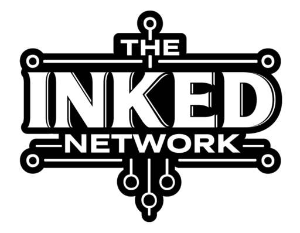

<h2 align="center">👋 Hey, I’m Connor Darling</h2>

I’m a software developer passionate about building interactive, high-performance web applications. Currently, my flagship project is **The Inked Network**, a full stack platform that connects tattoo collectors with artists worldwide, featuring AI powered search, auto tagging, and personalized recommendations

I'm also a current Software Engineering student at the University of California, Irvine

## Featured Project: The Inked Network

  
  <b>The Inked Network</b> is a modern web application that enables tattoo enthusiasts to explore, connect with, and book artists through interactive portfolios, an AI-enhanced search experience, and a Tinder-style art swiper.

**Live App:** [theinkednetwork.com](https://inked-network-app.vercel.app/)

 

---

### Tech Stack

<strong>Frontend:</strong> 

<strong>Backend & Auth:</strong> 

<strong>Hosting:</strong> 

<strong>Storage:</strong> 

<strong>APIs:</strong> 

<strong>Payments:</strong> 

<strong>Other:</strong> 
SEO Optimization, Real-Time Chat

---

### 📊 Project Highlights

- **170+ Artist Sign-Ups** within initial launch period
- **High-Performance Swiper Pagination** — optimized DOM node handling for smooth Tinder-like swiping
- **AI-Powered Search** — enables users to find art and artists more intuitively
- **Google Maps Integration** — interactive pins showing studios and artists by location
- **Image Optimization Pipeline** — compression, resizing, and CDN caching for fast load times
- **SEO-First Approach** — implemented meta tags, structured data, and SSR optimizations for visibility

---

## Key Features at a Glance

<table width="100%">
  <tr>
    <td width="50%" valign="top">

### Profiles

- Artist & studio pages
- AI auto-tags/titles on upload
- Smart crop & aspect ratio
- Link artist ↔ studio (studio pays)

### Discovery

- Tinder-style swipe + infinite scroll
- Tag filters & search
- Likes: save • view • remove

### Events

- Host-managed event pages
- RSVP & tickets
- See attending artists

    </td>
    <td width="50%" valign="top">

### Chat

- Real-time 1:1 messaging + photos
- Name search & pre-chat wizard
- Secure isolation via Supabase RLS

### Subscriptions & Preferences

- Stripe subscriptions (artist/studio)
- Map visibility toggle, themes, account settings

    </tr>
  </table>
