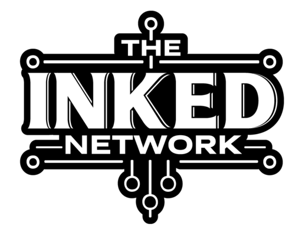

<h2 align="center">I’m Connor Darling</h2>

I’m a software developer passionate about building interactive, high-performance web applications. Currently, my flagship project is **The Inked Network**, a full stack platform that connects tattoo collectors with artists worldwide, featuring AI powered search, auto tagging, and personalized recommendations

I'm also a current Software Engineering student at the University of California, Irvine

## Featured Project: The Inked Network

  
  <b>The Inked Network</b> is a modern web application that enables tattoo enthusiasts to explore, connect with, and book artists through interactive portfolios, an AI-enhanced search experience, and a Tinder-style art swiper.

**Live App:** [theinkednetwork.com](https://inked-network-app.vercel.app/)

 

---

  
  
  
  
  
  
  
  
  
  
  
  
  

